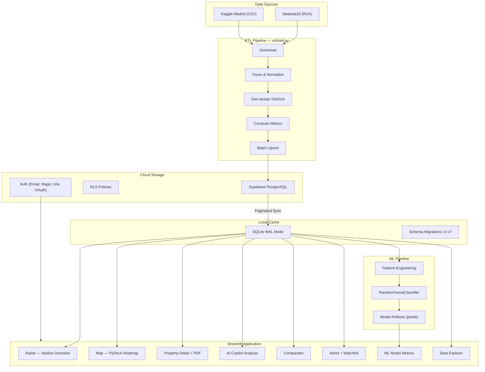
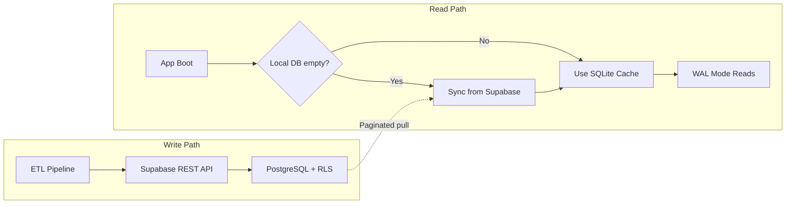

# Architecture — Vivienda AI

Technical architecture documentation for the Madrid real estate investment intelligence platform.

---

## System Overview



---

## Data Pipeline

### Ingestion

Two heterogeneous sources with different formats:

| Source | Format | Rows | Key Challenge |
|--------|--------|------|---------------|
| Idealista18 | RDA (bz2-compressed) | ~94K | Binary parse, coordinate filtering for Madrid M-30 |
| Kaggle | CSV | ~2K | Address-based district extraction via string matching |

Both are normalized to a **unified schema** (21 columns) before upload. The ETL runs as a one-shot CLI command:

```bash
python -m utils.etl              # local transform only
python -m utils.etl --supabase   # transform + upload
```

### Transform

The transform stage in `utils/etl.py` performs:

1. **Coordinate filtering** — Idealista18 rows filtered to Madrid bounding box (lat 40.35–40.50, lon -3.78–-3.58)
2. **District assignment** — Centroid-based geo-assignment to 21 Madrid districts (no external geocoding API needed)
3. **Feature engineering** — Computes `precio_m2_barrio`, `diferencia_pct`, `opportunity_score` heuristically
4. **Auxiliary tables** — Builds `barrio_rent`, `radar_oportunidades`, `distrito_mapping`, `mapas_distritos`

### Load

Batch upsert via Supabase REST API (`utils/etl.py:379`):

- **300 rows/batch** for the main `oportunidades` table (86K rows → ~287 requests)
- **NaN/Inf sanitization** before upload — Supabase INTEGER columns reject float JSON
- Idempotent: upsert overwrites existing rows on conflict

---

## Storage Architecture

### Why Hybrid?

Streamlit Cloud has **ephemeral filesystems** — SQLite files don't survive redeployments. But SQLite is essential for:

- Fast local reads (no network latency per query)
- WAL mode for concurrent reads during reruns
- Working offline / in development

**Solution**: Supabase as durable source of truth, SQLite as read-through cache.



### SQLite Configuration (`utils/connection.py`)

```sql
PRAGMA journal_mode=WAL        -- concurrent readers + 1 writer
PRAGMA synchronous=NORMAL      -- fsync only on checkpoint
PRAGMA cache_size=-8000        -- 8MB page cache
PRAGMA temp_store=MEMORY       -- temp tables in RAM
PRAGMA foreign_keys=ON         -- referential integrity
```

Two context managers enforce correct lifecycle:
- `get_conn()` — read-write with commit/rollback
- `get_conn_ro()` — read-only, no commit overhead

### Sync Strategy (`utils/supabase_sync.py`)

- **Trigger**: App boot when local DB is empty (`needs_sync()` checks row count)
- **Pagination**: 1000 rows/request (Supabase free tier limit)
- **6 tables synced**: `oportunidades`, `barrio_rent`, `radar_oportunidades`, `distrito_mapping`, `mapas_distritos`, `property_history`
- **Graceful degradation**: If Supabase is unreachable, app continues with stale local data

---

## Scoring Engine

### Dual Scoring System

The app maintains **two independent scoring systems** that coexist:

| System | Location | Transparency | Use Case |
|--------|----------|-------------|----------|
| Rule-based | `utils/profiles.py` | Fully explainable | Dashboard, filtering, comparison |
| ML (RandomForest) | `utils/train_model.py` | Black-box with feature importance | Prediction, model metrics page |

**Why both?** The rule system is the product — users need to understand *why* a property scores high. The ML model adds predictive power and demonstrates data science capability. They don't compete; they complement.

### Rule-Based Scoring (`utils/profiles.py:103`)

Five weighted dimensions, normalized to 0–100:

```
score_total = (
    score_descuento × peso_descuento +    # 40 pts max — price vs market
    score_precio   × peso_precio   +      # 25 pts max — price/m² vs barrio
    score_liquidez × peso_liquidez +      # 15 pts max — rental liquidity (50-90m² optimal)
    score_tamano   × peso_tamano   +      # 10 pts max — surface area
    score_ruido    × peso_ruido           # 10 pts max — noise level
) / max_possible × 100
```

Weights vary by investor profile (Strategy Pattern):

| Profile | Descuento | Precio | Liquidez | Tamaño | Ruido |
|---------|-----------|--------|----------|--------|-------|
| Básico | 1.0 | 1.0 | **1.5** | 1.0 | **1.2** |
| Intermedio | **1.2** | **1.2** | 1.0 | 1.0 | 0.8 |
| Avanzado | **1.5** | **1.5** | 0.8 | 0.8 | 0.5 |

**Design decision**: Profiles are pure configuration (dict), not inheritance. Adding a new profile = adding a dict entry. No class hierarchy, no factory — just data.

### ML Pipeline (`utils/train_model.py`)

```
SQLite → load_data() → feature engineering → train_test_split(80/20)
    → RandomForestClassifier(n_estimators=100, max_depth=12)
    → pickle.dump() → model/classifier.pkl
```

- **8 features**: score_descuento, score_precio, score_liquidez, score_tamano, precio_total, metros, precio_m2, rentabilidad_estimada
- **Target**: `decision` (COMPRAR / NEGOCIAR / DESCARTAR) derived from opportunity_score thresholds
- **Lazy loading**: `sklearn` imported inside `train()` to prevent boot crash on Python 3.14
- **Metrics persisted**: accuracy, classification report, confusion matrix, feature importance → `model/metrics.json`

---

## Authentication & Multi-Tenancy

`utils/auth.py` wraps Supabase Auth with three methods:

| Method | Flow | Config |
|--------|------|--------|
| Email/Password | Standard sign_up/sign_in | Zero config |
| Magic Link (OTP) | Email with token link | Zero config |
| Google OAuth | Redirect to Google → callback | Requires client ID/secret |

**Session management**: Stored in `st.session_state["supabase_session"]`. The `require_auth()` guard redirects unauthenticated users to `app.py`.

**Row-Level Security (RLS)**: Supabase policies ensure users can only read/write their own `user_preferences` and `watchlist` data. See `supabase_schema.sql` for policy definitions.

---

## Application Layer

### Page Architecture

Streamlit multi-page app with 11 pages, each following the same pattern:

```python
st.set_page_config(...)    # page title + icon
require_auth()              # auth guard
# ... business logic ...
# ... UI rendering ...
render_footer()             # attribution
```

| Page | Responsibility | Key Utils |
|------|---------------|-----------|
| `0_Bienvenida.py` | Onboarding tour | — |
| `1_Radar.py` | Market overview, semáforo cards | `services.py`, `profiles.py` |
| `2_Mapa.py` | PyDeck heatmap | `connection.py` |
| `3_propiedad.py` | Property detail + PDF export | `pdf_report.py`, `profiles.py` |
| `4_Analisis_Detallado.py` | AI Copilot analysis | `profiles.py` |
| `5_Comparador.py` | Side-by-side comparison | `services.py` |
| `6_Alertas.py` | Notifications + watchlist | `notifications.py`, `user_store.py` |
| `7_Mi_Cuenta.py` | User profile / account | `auth.py`, `user_store.py` |
| `8_Admin.py` | Admin panel | `admin.py` |
| `9_Modelo.py` | ML model metrics dashboard | `train_model.py` |
| `10_Explorador.py` | Full data explorer + ML predictions | `explorer_service.py` |

### Component Layer (`components/`)

Reusable UI components extracted from pages:

- `sidebar.py` — Shared navigation + notification badge
- `footer.py` — Data source attribution
- `cards.py` — Semaáforo card component (COMPRAR/NEGOCIAR/DESCARTAR)
- `score_help.py` — Score breakdown tooltip UI

### Data Access Pattern

```
Page → services.py (query builder) → connection.py (SQLite) → real_estate.db
Page ← DataFrame ← pd.read_sql()
```

No ORM. Direct SQL with parameterized queries. `services.py` provides typed query functions (`get_top_opportunities()`, `get_barrio_avg_scores()`) that encapsulate SQL logic.

---

## Market Simulation

The app includes a deterministic market simulator (`utils/db.py:64`) for demo/testing purposes:

- **20% chance** of price drop (5–1% discount)
- **8% chance** of flash sale (8–15% discount, time-limited)
- **Yield fluctuation** (±2% random walk)
- Events persisted to `events` table, surfaced in Alerts page

**Design choice**: Simulation is deterministic enough to demo but random enough to feel realistic. Events are the bridge between the write path (simulation) and read path (alerts).

---

## Key Design Decisions

### 1. SQLite over PostgreSQL locally

**Trade-off**: Lost ACID cross-transaction guarantees, gained zero-config local development and Streamlit Cloud compatibility.

**Why**: PostgreSQL requires a running server. SQLite is a file. For a single-user dashboard with <100K rows, the performance difference is negligible, and the operational complexity savings are enormous.

### 2. Rule-based scoring first, ML second

**Trade-off**: Less "impressive" than leading with ML, but far more useful to end users.

**Why**: An investor needs to understand *why* a property scores 72. "The random forest said so" is not actionable. The rule system is transparent, tunable, and debuggable. ML adds a prediction layer on top — it doesn't replace the rules.

### 3. Batch upsert over streaming

**Trade-off**: ETL is not real-time (~60s for 86K rows), but implementation is simple and idempotent.

**Why**: The data source (Idealista18) is a static 2018 snapshot. There's no streaming requirement. Batch upsert with idempotent conflict resolution is the right tool for this job.

### 4. Supabase Auth over custom JWT

**Trade-off**: Vendor lock-in to Supabase, but zero auth implementation effort.

**Why**: Auth is undifferentiated heavy lifting. Supabase gives us email/password, magic links, and Google OAuth with RLS integration — all in ~70 lines of wrapper code.

### 5. PDF generation with FPDF2

**Trade-off**: FPDF2's built-in fonts are Latin-1 only (no Cyrillic, no CJK), but it's pure Python with no system dependencies.

**Why**: `wkhtmltopdf` doesn't install on Streamlit Cloud. FPDF2 works everywhere. Madrid property data is Spanish — Latin-1 covers it.

---

## Scalability Considerations

This is a portfolio project serving a single user with 86K properties. That said, the architecture handles scale gracefully:

| Dimension | Current | Limit | Migration Path |
|-----------|---------|-------|----------------|
| Data volume | 86K rows | SQLite ~140TB max | PostgreSQL for multi-GB |
| Concurrent users | 1 | SQLite WAL handles ~100 | Connection pool + PgBouncer |
| Query latency | <50ms (local) | — | Add Redis cache layer |
| ETL frequency | One-shot | — | Schedule via Airflow/Prefect |
| ML retraining | Manual | — | Trigger on data freshness |

The **hybrid storage pattern** (cloud source + local cache) is the same pattern used in production systems where read latency matters more than write freshness.

---

## Testing Strategy

| Layer | Files | Coverage | Approach |
|-------|-------|----------|----------|
| Scoring logic | `tests/test_scoring.py` (8 tests) | Rule-based scoring | Pure arithmetic, no DB needed |
| ML pipeline | `tests/test_model.py` (4 tests) | Train → predict → label sanity | End-to-end, catches regressions |
| **Total** | 12 tests | Core business logic | <0.5s runtime |

**Philosophy**: Test the scoring engine and ML pipeline because they're the core value. UI tests (Streamlit) are brittle and low-value for a portfolio project.

---

## Tech Stack

| Layer | Technology | Version |
|-------|-----------|---------|
| Frontend | Streamlit | 1.55 |
| Visualization | Plotly, PyDeck | — |
| Backend | Python | 3.14 |
| Local DB | SQLite (WAL) | — |
| Cloud DB | Supabase (PostgreSQL) | — |
| Auth | Supabase Auth | — |
| ML | scikit-learn | — |
| PDF | FPDF2 | — |
| Deployment | Streamlit Cloud | — |

---

## File Map

```
app.py                          Entry point: auth gate + DB init + redirect
utils/
  etl.py                        ETL: download → transform → upload (479 lines)
  supabase_sync.py              Paginated pull: Supabase → SQLite (107 lines)
  connection.py                 SQLite context managers + WAL config (103 lines)
  db.py                         Market simulation + event persistence (135 lines)
  services.py                   Query layer (typed SQL wrappers)
  profiles.py                   Investment profiles + weighted scoring (216 lines)
  scoring.py                    Thin wrapper around profiles (7 lines)
  train_model.py                ML pipeline: load → train → save (133 lines)
  auth.py                       Supabase Auth wrapper (72 lines)
  notifications.py              Opportunity + price drop detection (117 lines)
  user_store.py                 User preferences + watchlist CRUD
  migrations.py                 Schema migrations v1-v7
  pdf_report.py                 FPDF2 report generation
  explorer_service.py           Data explorer backend
components/
  sidebar.py                    Shared nav + notification badge
  footer.py                     Data source attribution
  cards.py                      Semaáforo card component
  score_help.py                 Score breakdown tooltip
pages/
  0_Bienvenida.py               Onboarding tour
  1_Radar.py                    Market radar + semáforo
  2_Mapa.py                     PyDeck heatmap
  3_propiedad.py                Property detail + PDF
  4_Analisis_Detallado.py       AI Copilot
  5_Comparador.py               Side-by-side comparison
  6_Alertas.py                  Notifications + watchlist
  7_Mi_Cuenta.py                User account
  8_Admin.py                    Admin panel
  9_Modelo.py                   ML metrics dashboard
  10_Explorador.py              Data explorer + ML predictions
tests/
  test_scoring.py               8 tests: rule-based scoring
  test_model.py                 4 tests: ML pipeline
```
